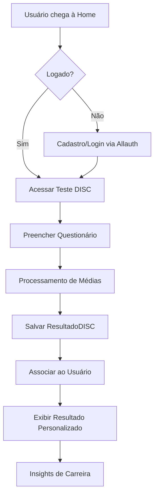
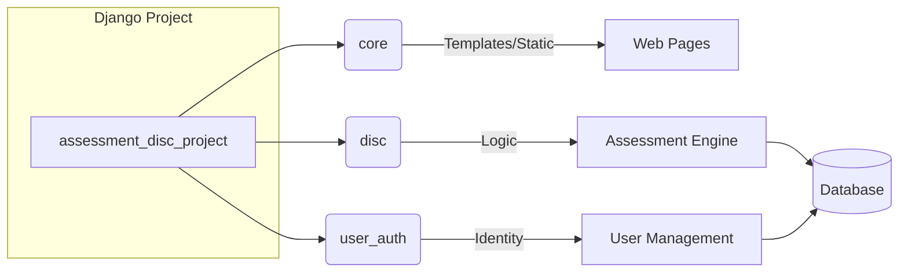
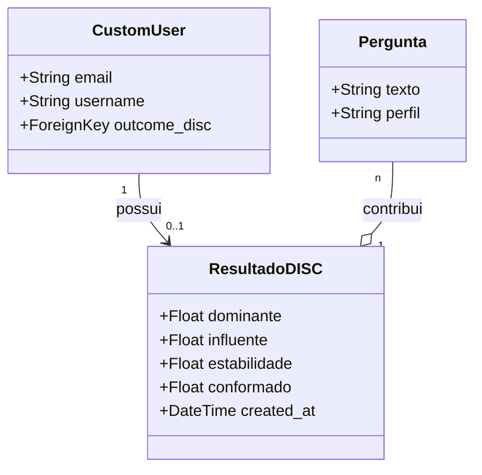

# Diagramas do Projeto - DISC Framework

Este arquivo contém diagramas que podem ser visualizados ou importados para ferramentas como Excalidraw (via Mermaid).

## Fluxo de Avaliação DISC

## Arquitetura de Módulos

## Modelo de Dados

